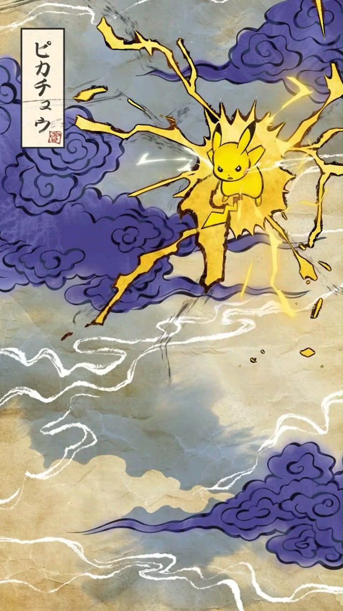

<!-- Header Banner -->

<h2 align="center">🚀 Building cool stuff with code</h2>

---

<table align="center" style="border: none; width: 100%;">
  <tr>
    <!-- Left Section -->
    <td align="center" style="width: 65%; vertical-align: middle;">

   

        💻 DJSCE • Full-Stack Dev • GenAI  
        🎮 Music • Games • Anime • Code • Art
   

     

   

        

          
          
LinkedIn

        

    <!-- Left Section -->
        

          
          
LeetCode

        

   

    <!-- Left Section -->
    </td>
    <!-- Left Section -->
    <!-- Right Section -->
    <td align="center" style="width: 35%; padding: 15px;">
      
    </td>
  </tr>
</table>

---
